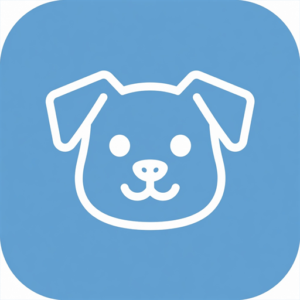
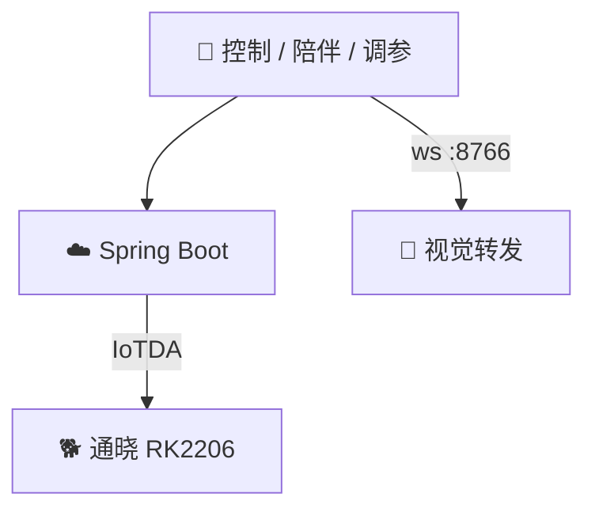

<div align="center">

# 📱 EDOG Application

**HarmonyOS 手机端** · 遥控 · 陪伴 · 调参 · 校准

[](https://github.com/yangzhiyong3508/Application)
[](https://github.com/yangzhiyong3508/edog_project_docker)
[](https://github.com/yangzhiyong3508/Edog_powered_by_rk2206)



<p><b>和你的机械狗一起玩：看视频、喊名字、跟你走、调步态。</b></p>

</div>

---

## ✨ 功能亮点

| | 模块 | 你能做什么 |
|:---:|:---|:---|
| 🎮 | **控制页** | 实时图传预览、九宫格遥控、跟随开关、语音人设 |
| 💬 | **陪伴页** | 学我说话 / 陪我聊天、喂食·逗它·夸奖·复原 |
| 📐 | **运动调参** | 前后俯仰、步长/步高、速度等级一键下发 |
| 🔧 | **舵机校准** | 12 路有效通道物理中位角微调 |
| ⏰ | **提醒 / 记录** | 事件提醒、扣子聊天历史 |



---

## 🗂️ 工程结构

```text
Application/
├── AppScope/                      # 应用级资源
├── entry/src/main/
│   ├── ets/
│   │   ├── pages/                 # Control · Conversation · MotionTuning · ServoAdjust …
│   │   ├── components/            # 卡片、芯片、输入等 UI
│   │   ├── utils/                 # HTTP · 图传 WS · 调参 · 校准
│   │   └── theme/
│   └── resources/base/media/      # 图标与插画
├── hvigor/
└── oh-package.json5
```

---

## 🛠️ 开发与运行

**环境：** DevEco Studio + 匹配的 HarmonyOS SDK / ohpm  

1. 打开本仓库根目录  
2. 同步依赖  
3. 真机或模拟器 Run `entry`  

```bash
# 已配置 hvigor 时
hvigorw assembleHap
```

> 后端地址、视觉 IP 可在 App 内配置（`localhost` / `deeplearning_ip`）。

---

## 🔌 与后端约定（速查）

| 能力 | 接口 |
|------|------|
| 遥控 | `POST /action` |
| 跟随 | `GET/POST /tracker/status` |
| 语音人设 | `/api/accounts/updateVoice` · `updateWakeWord` |
| 调参 | `/api/dog-debug/config` · `runtime-tuning` |
| 舵机 | `/api/dog-debug/*` |
| 图传 | `ws://{deeplearning_ip}:8766` |

---

## 🔗 相关仓库

| 端 | 链接 |
|----|------|
| 主仓 | [Edog_powered_by_rk2206](https://github.com/yangzhiyong3508/Edog_powered_by_rk2206) |
| 后端 | [SpringBoot](https://github.com/yangzhiyong3508/SpringBoot) |
| 视觉 | [DeepLearning](https://github.com/yangzhiyong3508/DeepLearning) |
| 图传 | [ESP32](https://github.com/yangzhiyong3508/ESP32) |
| 固件 | [edog_project_docker](https://github.com/yangzhiyong3508/edog_project_docker) |

<div align="center">

⭐ 遥控只是开始，陪伴才是终点

</div>
